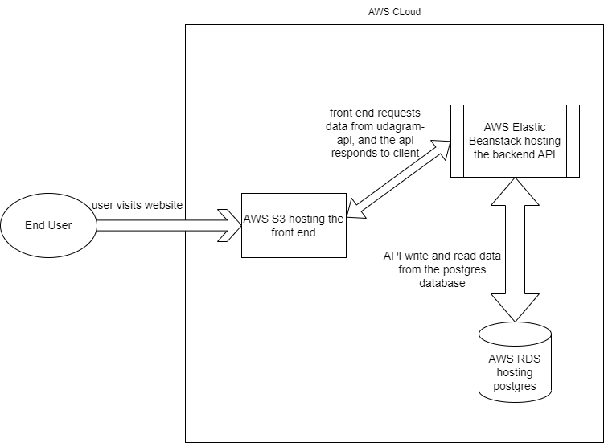
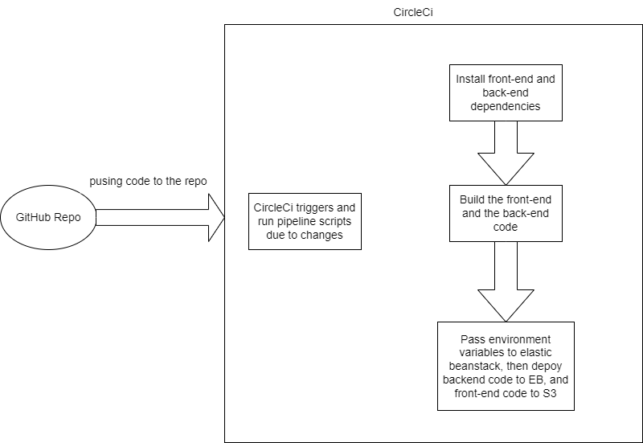

# Hosting a full-stack application on AWS

_After making sure the app is working locally properly, we are ready to host it to AWS using the following steps_

## Steps

### Set up AWS services infrastructure

-   Create an AWS database to host the postgres database, please refer to [RDS documentation](./RDS.md).
-   Create an Elastic Beanstack environment to host the back-end, please refer to [EB documentation](./EB.md).
-   Create S3 bucket to host the front-end, please refer to [S3 documentation](./S3.md).

_Here is the AWS infrastructure diagram after creating the services_

_Now after settig up all needed AWS services, we are ready to set up an automated pipeline using CircleCi_

### Set up CircleCi automated pipeline

-   Create config.yml inside .circleci folder in the root of the app, and add all needed scripts to it.
-   Create a CircleCi account and connect it to GitHub.
-   Choose the repo for hosting the full-stack app to build it.
-   Now whenver we push code to the repo master branch, CircleCi will run the pipeline.

#### CircleCi pipeline

_it runs some jobs which are scripts to install dependencies, build and deploy the application_

-   it setup node.js, AWS CLI, and eb CLI.
-   it install back-end and front-end dependencies.
-   it build the front-end and back-end code.
-   it deploy the front-end to S3 and the backend to eb.

_Note: we should add all needed environment variables to CircleCi, so Elastic Beanstack works properly._

_Here is the CircleCi pipeline diagram_

